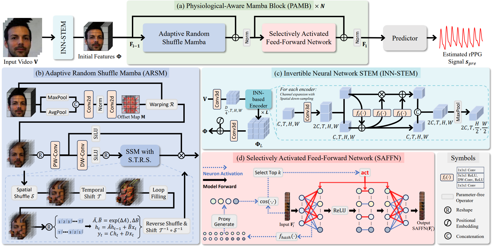

### PAMNet

---

#### Introduction

Main code of [**PAMNet: Lightweight Physiological-Aware Mamba for Robust and Efficient Video-Based Remote Physiological Measurement**]().



---

#### Reproduce our method

##### 1 video preprocess

- For any video dataset, we need crop the face firstly, use:

```shell
python ./datasets/video_preprocess.py --dataset {dataset_name}
```

##### 2 dataset preprocess

- For any video dataset, we need prepare the dataset for training, use:

```shell
python ./datasets/dataset_preprocess.py --dataset_dir {dataset_dir} --dataset {dataset_name}
```

##### 3 train PAMNet on the fold-1 of VIPL-HR dataset

- Train PAMNet by:

```shell
python ./trainer.py --save_path /path/to/save_dir/ --dataset {dataset_name} --dataset_dir /path/to/dataset --fold 1
```

##### 4 test

- To test the model, ref. to test_results.ipynb
- For computational cost evaluation, run:

```shell
python ./archs/PAMNet.py
```